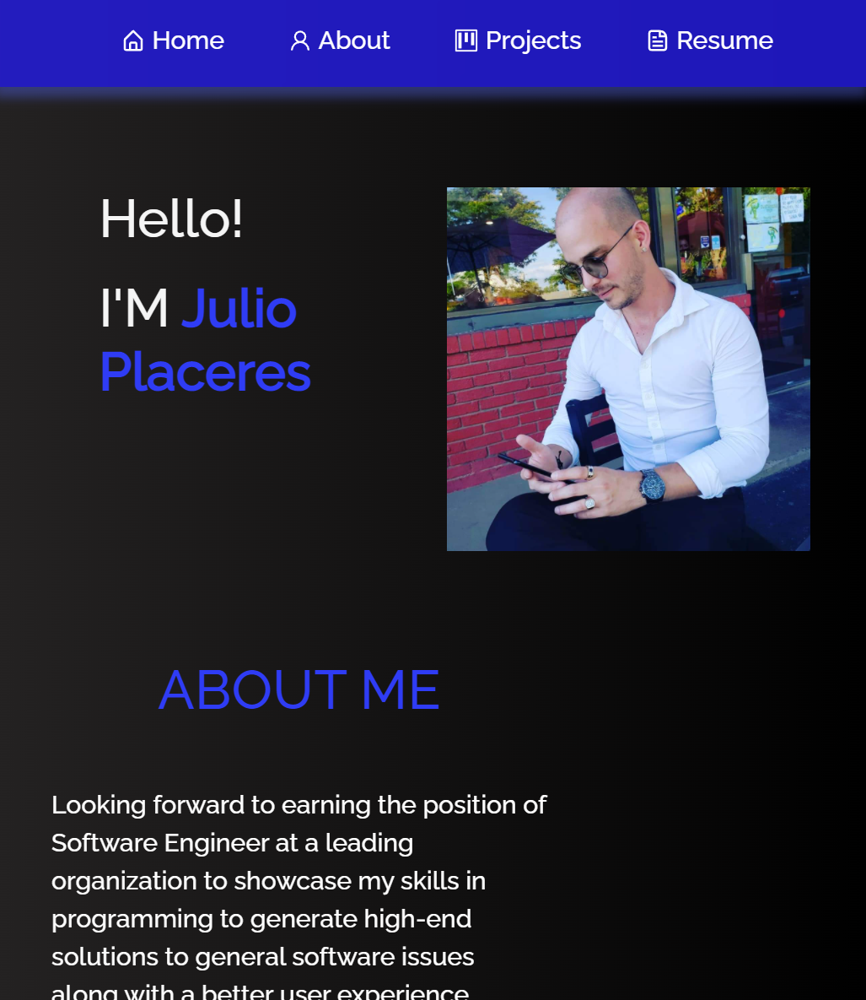

# React Portfolio  
A responsive web app built using React, with a downloadable resume and sample projects.

# Screenshot



## Table of Contents:
* [Installation](#installation)
* [Usage](#usage)
* [License](#license)
* [Contributing](#contributing)
* [Tests](#tests)
* [Questions](#questions)
### Installation:
To install dependencies, run the following:
```N/A```
### Usage:
Feel free to use it as a template
### License:
This project is licensed under:
MIT
### Contributing:
N/A
### Tests:
To run the test enter the following:
```N/A```
### Questions:
If you have any questions contact me at [GitHub](https://github.com/julioPlaceres) or contact me at jplaceresvaldes@outlook.com
    
 